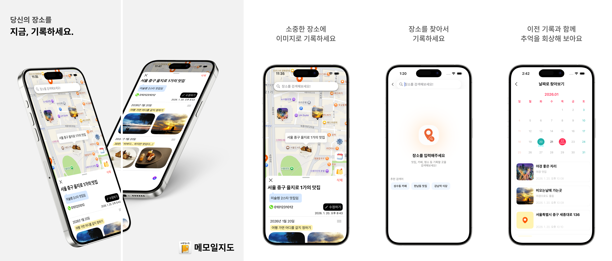

# 메모일지도 README

- 메모일지도는 Swift로 구현한 지도 기반 메모 앱입니다.

> 일상 속 스쳐 지나가는 수많은 장소들은 종종 생각보다 더 깊은 의미를 지닙니다. <br>
> 이런 장소에 담긴 우리의 추억과 경험은 시간이 지나며 희미해지기 쉬운데, <br>
> 이 순간들을 더 구체적으로 기록으로 남길 수 있다면 어떨까요?

# 소개 이미지



# 📷 메모일지도 프로젝트 소개

> 지도를 기반으로 메모와 사진을 남길 수 있는 앱입니다.

- 글과 사진을 기록
- 지도
- 장소 검색
- 커스텀 마커
- 클러스터링
- 날짜별 메모 찾기

## 📁 폴더 구조

```
.
├─ MapbeDiary/                 앱 소스 루트
│  ├─ App/                     앱 엔트리/설정
│  ├─ Assets 2.xcassets/       에셋 카탈로그
│  ├─ Core/                    공통 유틸, 확장
│  ├─ Data/                    저장/저장소 구현
│  ├─ Doc/                     문서/소개 이미지 (MDFullPhoto.png)
│  ├─ Domain/                  모델, 프로토콜
│  ├─ Features/                화면 단위 모듈
│  └─ Network/                 네트워크 계층
├─ MapbeDiaryTests/            단위 테스트
├─ MapbeDiaryUITests/          UI 테스트
├─ SearchWidget/               위젯 모듈
├─ en.lproj/                   영어 로컬라이즈
└─ ko.lproj/                   한국어 로컬라이즈
```

## 📸 개발 기간

> 3/4 ~ 3/24 ( 약 3주간 )

# 📷 사용 기술

- UI/Framework: UIKit, MapKit, CodeBaseUI, SnapKit, Compositional Layout
- Architecture: MVVM, ReactorKit, Facade, Router, Repository, Strategy, Singleton
- Network/Data: URLSession, Decodable, Realm(Swift)
- Analytics: Firebase Analytics, Crashlytics
- UI Components: FloatingPanel, IQKeyboard, Toast
- External API: KAKAO REST API (키워드 장소 검색, 좌표→주소 변환)

# 📷 기술 설명

## MVVM

> Custom Observable 클래스를 생성하여 MVVM input-output 패턴을 통해
> 비즈니스 로직을 분리하여 재사용성을 높였습니다.

## URLSession

> API 요청 시 각각의 에러를 직접 핸들링하기 위해
> Router 패턴과 전략 패턴을 섞어 각 API의 에러 코드나
> URLResponse 등의 에러를 핸들링했습니다.

## Realm Swift

> EmbeddedObject와 LinkingObject를 통해
> 1:N 관계를 관리했으며, 각각의 에러를 enum으로 정의해
> 에러를 컨트롤했습니다.


## Firebase Crashlytics / Analytics

- 실사용 중 발생하는 문제를 분석/보완하기 위해 **Crashlytics**를 적용했습니다.
- 뷰별 이탈 지점을 파악하기 위해 **Analytics**를 적용했습니다.

# 📷 앱 흐름도


# 새롭게 학습한 부분과 고려한 사항

## 네트워크 오프라인 상황에서도 작동하도록

> 네트워크에 연결되어 있지 않아도 앱이 동작하도록 <br>
> 네트워크 상태를 감지하는 클래스를 만들어 메모/사진 기록 흐름을 유지했습니다.

```swift
import Network
final class NetWorkServiceMonitor {

    static let shared = NetWorkServiceMonitor()
    private let queue = DispatchQueue.global(qos: .background)
    private let monitor: NWPathMonitor
    public private(set) var isConnected: Bool = false
    public private(set) var connectionType: ConnectionType = .unknown

    enum ConnectionType {
        case cellular
        case ethernet
        case unknown
        case wifi
    }
    // 네트워크 상태 확인
    public func startMonitor() {}
}
```

## 카메라와 갤러리 권한을 관리하는 클래스 (Facade 패턴)

> 여러 화면에서 카메라/갤러리 권한 요청과 이미지 수신 로직이 반복되어 <br>
> 권한 확인, 요청, 결과 전달을 단일 서비스로 모았습니다. <br>
> Facade 패턴으로 호출부를 단순화했습니다.

```swift
enum PhotosManagerError: Error {
    case cantGetImage
    case busy
}

@MainActor
final class PhotosManager: NSObject {
    func pickFromCamera(
        presenter: UIViewController,
        allowsEditing: Bool = true
    ) async throws -> [UIImage]? { ... }

    func pickFromLibrary(
        presenter: UIViewController,
        maxSelection: Int
    ) async throws -> [UIImage]? { ... }

    func checkCameraPermission() async -> Bool { ... }
}
```

# **Localization**

> 한국에서 사용하는 앱이지만, 국내 거주 외국인을 고려해 <br>
> 영문 로컬라이즈(현지화)를 적용했습니다.

```swift
// Localizable.strings (ko)
"Error_alert_title" = "에러";

"Alert_check_title" = "확인";

"Cancel_check_title" = "취소";

"Kakao_error_message_type1" = "서비스에 문제가 발생했습니다. 다시 시작해주세요!";
......
// Localizable.strings (en)
"Error_alert_title" = "Error";

"Alert_check_title" = "check";

"Cancel_check_title" = "Cancel";

"Kakao_error_message_type1" = "There was a problem with the service, please restart it!";
.....
```

# 이슈 대응

## 패널 내려가는 도중 새로운 패널에 의한 (UI 비동기 이슈)

> 패널을 보고 있는 동안 다른 패널을 띄울 때, 기존 패널이 내려가는 중에 새로운 패널이 올라와 <br>
> 원래 패널이 deinit 되었음에도 화면에 남는 UI 비동기 이슈가 있었습니다.

> 패널이 완전히 내려갔음을 @escaping으로 감지한 뒤 <br>
> 새 패널을 렌더링하도록 순서를 보장해 해결했습니다.

```swift
// MARK: 패널을 내리고 싶을 때
    private func removeExistingPanelIfNeeded(completion: @escaping () -> Void) {
        if let existingPanel = floatPanel {
            existingPanel.removePanelFromParent(animated: true) { [weak self] in
                self?.floatPanel = nil
                completion()
            }
        } else {
            completion()
        }
    }
```

```swift
    private func updateFloatingPanel(with configuration: PanelConfiguration) {
        removeExistingPanelIfNeeded { [weak self] in
            self?.setupPanel(with: configuration)
        }
    }
```

## 이미지 리사이징 이슈와 메모리 관찰


> 버튼/마커 적용 시 이미지가 너무 커 영역을 벗어나는 문제가 있었습니다. <br>
> 리사이징 전/후 메모리 사용량을 비교했고, <br>
> 리사이징 후 저장된 이미지를 불러오는 방식이 가장 효율적이어서 채택했습니다.

### 이미지 리사이징 전


### 이미지 리사이징 후

(이미지 저장할 때 리사이징 후 저장)


```swift
// MARK: 이미지 리사이징
    func resizingImage(targetSize: CGSize) -> UIImage? {
        let widthScale = targetSize.width / self.size.width
        let heightScale = targetSize.height / self.size.height

        let minAbout = min(widthScale, heightScale)

        let scaledImageSize = CGSize(width: size.width * minAbout, height: size.height * minAbout)

        let render = UIGraphicsImageRenderer(size: scaledImageSize)

        let scaledImage = render.image { [weak self] _ in
            guard let self else { return }
            draw(in: CGRect(origin: .zero, size: scaledImageSize))
        }
        return scaledImage
    }
```

---
